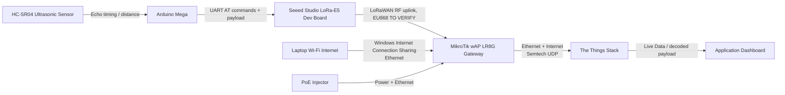
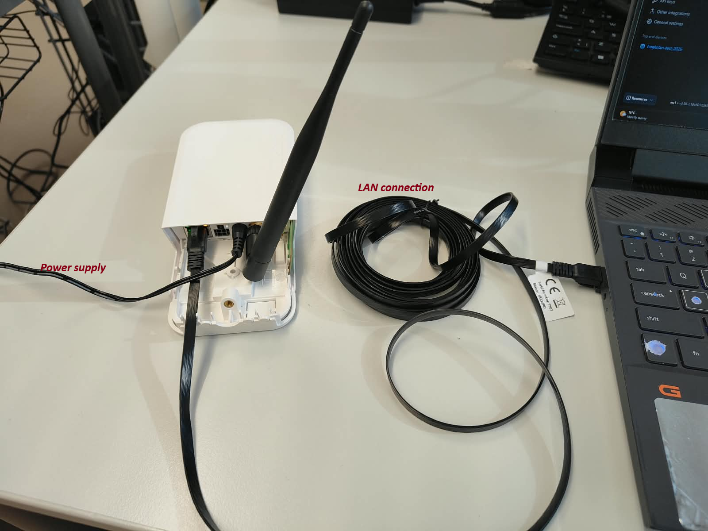
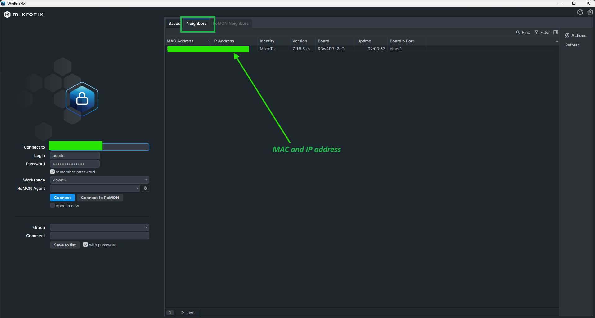
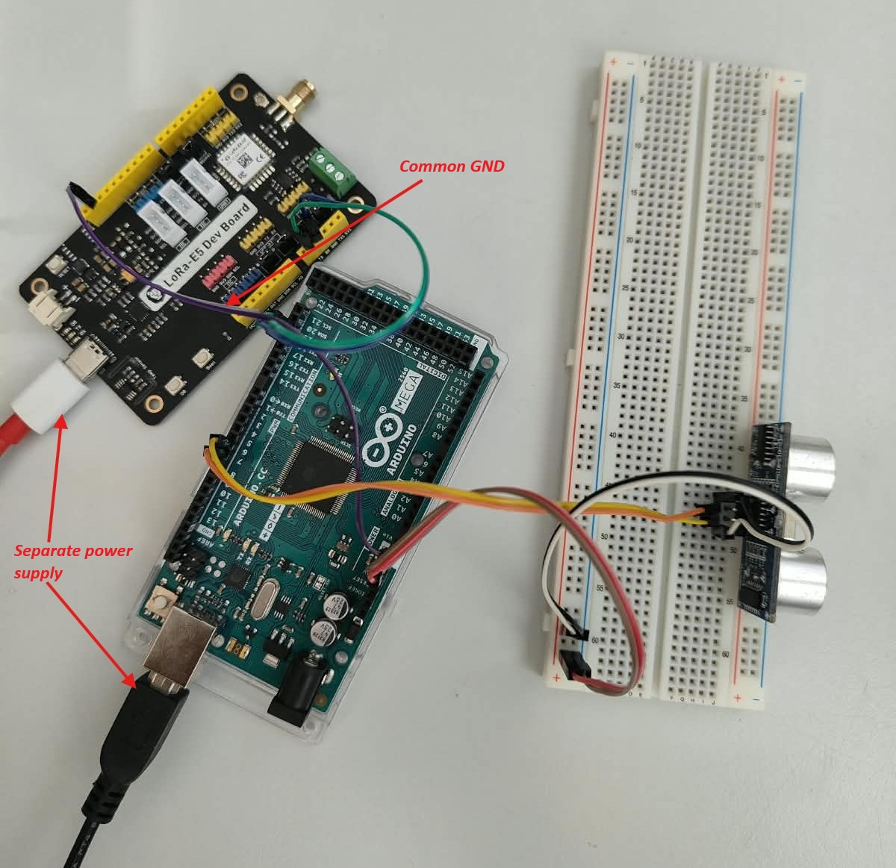
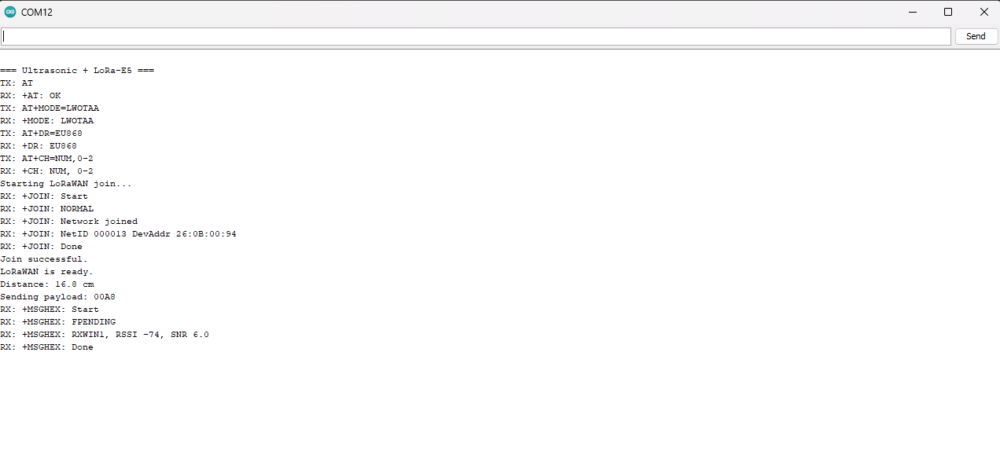
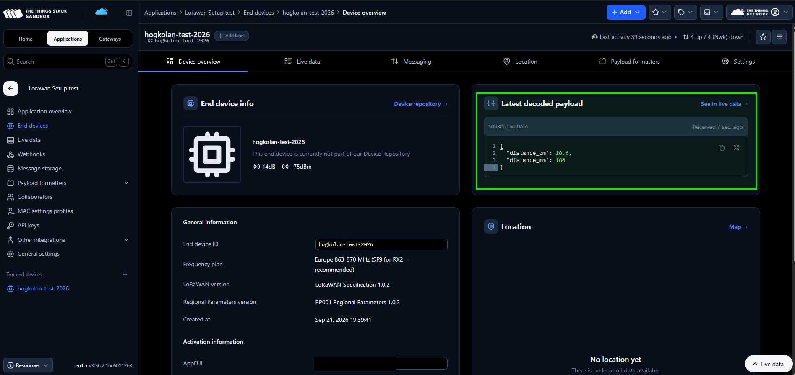
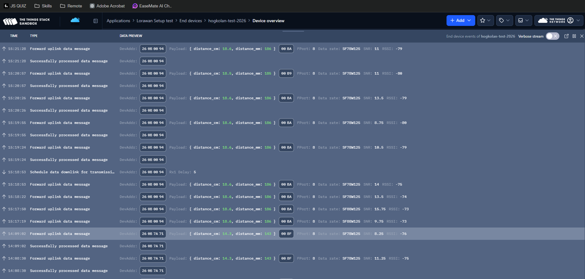

# LoRaWAN wAP LR8G kit by Microtik Setup and Test - Halmstad University

A LoRaWAN proof-of-concept setup for MikroTik wAP LR8G kit.  It uses MikroTik wAP LR8G gateway for lorawan networking and an HC-SR04 ultrasonic sensor, Arduino Mega, Seeed Studio LoRa-E5 Dev Board, and The Things Stack for the testing purposes.

For the testing the system measures distance with an ultrasonic sensor(HC-SR04)and Arduino Mega(Any dev board can be used), transmits the reading over LoRaWAN, forwards it through the MikroTik gateway, and displays the received data in The Things Stack.

> **Project status:** Prototype / educational setup  
> **Region:** Sweden; configure all LoRaWAN components for the appropriate regional plan, expected to be EU868.

---

## Table of Contents

- [Introduction](#introduction)
- [Hardware](#hardware)
- [System Architecture](#system-architecture)
- [Prerequisites](#prerequisites)
- [Setup Steps](#setup-steps)
- [Schematics](#schematics)
- [Test Setup](#test-setup)
- [Output and Test Results](#output-and-test-results)
- [Troubleshooting](#troubleshooting)
- [Conclusion](#conclusion)
- [Disclaimer](#disclaimer)
- [Official Documentation](#official-documentation)

---

## Introduction
The **MikroTik wAP LR8G kit** is a compact, weatherproof **LoRaWAN gateway** for Internet-of-Things projects in the European 868 MHz band. It receives long-range, low-power LoRaWAN messages from sensor nodes—such as your LoRa-E5—and forwards them over Ethernet or Wi-Fi to a network server such as The Things Stack using the Semtech UDP packet-forwarder protocol. 

It includes an integrated 868 MHz LR8G LoRa concentrator, built-in GPS, 2.4 GHz Wi-Fi (802.11b/g/n), one 10/100 Ethernet port, passive PoE support, and runs MikroTik RouterOS. Its IP54 enclosure and tested operating range of -40 °C to 60 °C make it suitable for protected outdoor or industrial deployments. [mikrotik](https://mikrotik.com/product/wap_lr8g_kit)

A MikroTik wAP LR8G kit need to be registered with the network server like **The Things Stack** or **ChirpStack.** It identifies the registered end device and makes the data available in the application Live Data view.

### Goals

- Configure the MikroTik wAP LR8G as a LoRaWAN gateway step by step.
- Connect the gateway to The Things Stack.
- Register and join a LoRa-E5 LoRaWAN end device through OTAA.
- Prepare the test setup 
- Measure distance using an HC-SR04 sensor.
- Transmit distance data from Arduino Mega to The Things Stack through LoRaWAN.
- Verify traffic at gateway and application level.

---

## Hardware

| Component | Role |
|---|---|
| MikroTik wAP LR8G kit | LoRaWAN gateway and UDP packet forwarder |
| MikroTik passive PoE injector or LAN Cable | Powers the wAP LR8G and carries Ethernet data |
| Laptop with Wi-Fi | Temporary internet source and gateway configuration device |
| Arduino Mega | Reads ultrasonic sensor data and sends AT commands to LoRa-E5 |
| Seeed Studio LoRa-E5 Dev Board | LoRaWAN modem/end-device radio |
| HC-SR04 ultrasonic sensor | Measures distance |
| Jumper wires | Electrical connections |
| Stable LoRa-E5 power supply | Recommended independent power for reliable radio operation |

| The Things Stack account | LoRaWAN network server and application dashboard |

---

## System Architecture

### Role of wAP-LR8G-kit in Lorawan based system

The MikroTik wAP LR8G is not the sensor controller and does not directly decode the application meaning of distance data. Its role is to receive LoRaWAN radio packets from the LoRa-E5 and forward them through an internet connection to The Things Stack.

For instance in testing setup HC-SR04 sensor is the sensing layer. The Arduino Mega is the microcontroller layer. The LoRa-E5 is the LoRaWAN end-device/modem layer. The wAP LR8G is the gateway layer. The Things Stack is the network and cloud layer.



### Device Roles

| Layer | Device | Responsibility |
|---|---|---|
| Sensor | HC-SR04 | Generates ultrasonic distance measurement |
| Microcontroller | Arduino Mega | Measures pulse timing, calculates distance, builds payload |
| LoRaWAN node | LoRa-E5 Dev Board | Performs OTAA join and sends LoRaWAN uplinks |
| Gateway | MikroTik wAP LR8G | Receives RF packets and forwards them to network server |
| Network server | The Things Stack | Authenticates gateway/device traffic and handles LoRaWAN sessions |
| Application/cloud | The Things Stack application | Shows Live Data and can forward data to MQTT, webhooks, or storage later |


---

## Prerequisites

Before beginning, ensure that you have:

- A powered MikroTik wAP LR8G with its LoRa antenna attached (Note that wap-LR8g have internal and external antenna support, internal has shorter range (few km) while external antena can extend longer range).
- A laptop that can connect to the wAP LR8G through Ethernet and the PoE injector.
- Internet access, either through a router or laptop Wi-Fi shared to Ethernet.
- A The Things Stack account.
- A registered gateway in The Things Stack.
- An application created in The Things Stack.
- A LoRa-E5 Dev Board configured for the same LoRaWAN regional plan as the gateway and end device registration.
- An Arduino Mega and HC-SR04 sensor.
- A safe 3.3 V UART input arrangement for LoRa-E5 RX.

> ⚠️ **Disclaimer — Region settings**  
> All LoRaWAN components must use a compatible regional frequency plan. For Sweden, it was setup at **Europe 863-870 MHz**, but confirm the selected frequency plan in The Things Stack and the LoRa-E5 configuration before transmitting. More on this in later section. 

---

## Setup Steps

### 1. Connect and power the wAP LR8G

Use any of the following alternative for power and network. **In this setup, external power supply is used and wap LR8G is connected with laptop via LAN cable  for connection and internet sharing from laptop**. Setup can be seen in picture below. 

```text
wAP LR8G Ethernet port  <-->  PoE+DATA port on injector
                or
Laptop/router Ethernet  <-->  LAN port on injector
Power supply            <-->  Power Input
```

Attach the LoRa antenna before powering the gateway.

> ⚠️ **Troubleshooting — Don't have external antena?**  
> You can use the internal antena provided inside. You need to unscrew the box cover and connect the internal antena to the socket. Use official documentation for the reference. 

I used external antena for easy setup.



### 2. Access the MikroTik gateway

Use either WebFig or WinBox. 
 - **WebFig:** is the router’s built-in web-based management interface, accessed through a browser without installing software. For your wAP LR8G, open: http://192.168.88.1 or use the router’s current IP address

 - **WinBox:** is MikroTik’s desktop application for configuring and monitoring RouterOS devices. Download it from the official MikroTik page: [MikroTik WinBox download](https://mikrotik.com/download/winbox)


- Default management address: `http://192.168.88.1`
- **WinBox is recommended** when IP access is uncertain because it can discover and connect through the MikroTik MAC address **(Used in this setup)**.

If your laptop does not receive an address automatically, temporarily set its Ethernet adapter to:

```text
IP address: 192.168.88.2
Subnet mask: 255.255.255.0
Gateway: blank
DNS: blank
```

Then browse to:

```text
http://192.168.88.1
```

> ⚠️ **Troubleshooting — `192.168.88.1` does not open**  
> If you're using winFig or want to access via ip address, make sure wap-lr8g is getting internet access (directly connect it with wifi router or let your laptop share it's internet access via lan port). Also your device and wap-lr8g should be on the same network.
> Note that , In this step internet access to wap-lr8g is not mandatory. 
> Disconnect Wi-Fi temporarily during local setup if routing becomes confusing. Open WinBox, use the Neighbors discovery list, and connect through the device MAC address.

- A successfull mac address connection shoud look like this, with mac address listing in **Neighbors** discovery list :



### 3. A quick setup
1. Log in as admin. The initial password is either blank or shown on the sticker, depending on the shipped unit.
2. In Quick Set, set:
    - Your country: Sweden
    - A strong Wi-Fi password
    - A strong router/admin password
3. Use Check for updates and update RouterOS. The current official guide says this device supports RouterOS v7.17 or later.

### 4. Register the gateway in The Things Stack

1. Find the **LR Gateway ID** or Gateway EUI on the wAP LR8G label.
2. Log in to The Things Stack Console.
3. Create or open the gateway entry.
4. Enter the MikroTik gateway EUI exactly as printed.
5. Choose the gatewayID (A unique readable name, such as hogs-wap-test)
6. Select the correct frequency plan **Europe 863-870 MHz recomended for europe**.
7. Gateway server address: Leave the default unless the console specifies another address
6. Save the gateway.

> ⚠️ **Troubleshooting — Gateway appears offline**  
> Registration alone does not connect the gateway. The wAP LR8G must have internet access and must be configured to forward packets to the correct The Things Stack server.

### 4. Add The Things Stack server in WinBox

In WinBox:

1. Open **LoRa**.  
   On some RouterOS versions, this may appear under **IoT → LoRa**.
2. Open the **Servers** tab.
3. Click **+**.
4. Create a server entry:

```text
Name: TTS
Address: <server address shown in The Things Stack gateway overview>
Up Port: 1700
Down Port: 1700
```

5. Click **OK**.

> ⚠️ **Troubleshooting — Which IP address belongs in Address?**  
> Do not enter the laptop IP address, the MikroTik management IP address, or the gateway IP address. Enter the **The Things Stack server hostname/address** shown in the gateway overview. It should be something like **eu1.cloud.thethings.network**

> ⚠️ **Troubleshooting — Ports are not visible in The Things Stack**  
> For the Semtech UDP packet-forwarder setup, use `1700` for both uplink and downlink unless your own private server explicitly states different values.

### 5. Enable the LoRaWAN gateway

1. In the same **LoRa** window, open the **Devices** tab.
2. Double-click the LR8G device entry.
3. Select the server entry created in the previous step.
4. Click **Enable**.
5. Click **OK** to save.

### 6. Give the wAP LR8G internet access

The gateway requires internet access to forward LoRaWAN packets to The Things Stack.

For this prototype, laptop Wi-Fi internet can be shared to the Ethernet adapter connected to the LAN port.

```text
Laptop Wi-Fi --> Windows Internet Connection Sharing --> Laptop Ethernet
                                                     --> PoE injector LAN
                                                     --> wAP LR8G
```

> ⚠️ **Troubleshooting — “This gateway has not made any connection attempts yet”**  
> This usually means the gateway has no working route to The Things Stack, or its server address/ports are wrong. Verify internet sharing, server address, ports `1700/1700`, gateway EUI, and gateway frequency plan.

### 7. Test gateway internet from WinBox

Open **New Terminal** in WinBox and run:

```routeros
ping 8.8.8.8
```

Then test DNS and The Things Stack reachability:

```routeros
ping <the-things-stack-server-address>
```

Expected result:

- `ping 8.8.8.8` succeeds: basic internet path is working.
- IP ping succeeds but server hostname ping fails: DNS may be missing or misconfigured.
- Both fail: laptop sharing, Ethernet link, routing, or firewall needs investigation.

> ⚠️ **Troubleshooting — Windows ICS is enabled but no internet is available**  
> Confirm that sharing is enabled on the laptop Wi-Fi adapter and shared specifically to the Ethernet adapter. Confirm Ethernet link LEDs and that the wAP receives a usable IP configuration.

### 8. Create an application in The Things Stack

1. In The Things Stack Console, go to **Applications**.
2. Create an application, for example:

```text
Application ID: ultrasonic-lab
```

3. Save it.

The application acts as a container for end devices and their received data.

### 9. Register the LoRa-E5 end device

Inside the application:

1. Select **Add end device**.
2. Choose manual registration if needed.
3. Use a clear End Device ID, for example:

```text
lora-e5-ultrasonic
```
4. Get the DevEUI, JoinEUI and AppKey of end device (Lora-E5-Dev-Board)
    - Connect the Lora-E5-Dev-Board with laptop
    - Note down the port it connected to 
    - Open arduino terminal or any UART serial Interface 
    - Select baud rate at 9600 
    - Select correct port 
    - In terminal type `AT` and press `ENTER` 
    - `OK` Status message should display 
    - Get the DevEUI and JoinEUI from follwing command:
        - **DevEUI** from `AT+ID=DevEui`
        - **JoinEUI** from `AT+ID=AppEui`
5. Add the **DevEUI** and **JoinEUI** to the things stack end device 
        - Get the AppKey from the auto generated feature (you can make your own App key)
        - Add the APPkey to lora-e5 board by : `AT+KEY=APPKEY,"YOUR_32_CHARACTER_HEX_APPKEY"`

> ⚠️ **Troubleshooting — JoinEUI versus AppEUI**  
> The Things Stack calls this value **JoinEUI**. The LoRa-E5 AT firmware calls it **AppEUI**. They refer to the same value for this setup.

### 10. Optional: You can set your own AppEui, JoinEUI, or AppKey. Use following AT command to read, write and edit the key

Connect to the LoRa-E5 serial interface and send the required AT commands.

Read identifiers:

```text
AT+ID=DevEui
AT+ID=AppEui
```

Set credentials using values from The Things Stack:

```text
AT+ID=AppEui,"<JOIN_EUI>"
AT+KEY=APPKEY,"<APP_KEY>"
```

> ⚠️ **Troubleshooting — `+KEY: ERROR(-1)`**  
> The AppKey must contain exactly 32 hexadecimal characters. Only `0-9` and `A-F` are allowed. Do not include other letter like `G`, spaces, or hidden characters.

> ⚠️ **Security note**  
> Do not commit AppKeys to GitHub, screenshots, public reports, or shared Arduino source files. Store secrets in a local configuration file that is excluded from version control.

### 11. Join the LoRaWAN network

Use OTAA join:

```text
AT+JOIN
```

Expected successful output resembles:

```text
+JOIN: Start
+JOIN: NORMAL
+JOIN: Network joined
+JOIN: NetID ...
+JOIN: Done
```

> ⚠️ **Troubleshooting — `Please join network first`**  
> This response means an uplink was attempted before the LoRa-E5 completed a successful OTAA join. Confirm `Network joined` before using `AT+MSGHEX`.

> ⚠️ **Troubleshooting — Manual join works but Arduino program fails**  
> Joining is asynchronous and can take longer than a short fixed delay. The Arduino code must wait for and parse the complete join result before sending sensor data.

### 12. Send a test uplink

After a successful join, test with:

```text
AT+MSGHEX="01C8"
```

Expected output:

```text
+MSGHEX: Start
+MSGHEX: Done
```

This example can represent a two-byte value. The final payload format used by the Arduino must match the payload formatter configured in The Things Stack.

## Schematics for Test 

### Arduino, HC-SR04, and LoRa-E5 Wiring

```text
HC-SR04                       Arduino Mega
-------                       ------------
VCC       ------------------> 5V
GND       ------------------> GND
TRIG      ------------------> D6
ECHO      ------------------> D7


Arduino Mega                 LoRa-E5 Dev Board
------------                 ------------------
GND       ------------------> GND
TX1 D18   --> level shift (optional)--> RX
RX1 D19   <------------------ TX

Independent stable power ----> LoRa-E5 VCC
Independent power GND -------> Common GND with Arduino
```

> ⚠️ **Electrical safety note**  
> If face problem with transmission from Arduino to LoRa-e5 Dev board, one reason may be because Arduino Mega TX1 is 5 V logic while the LoRa-E5 RX is 3.3 V logic. Use a proper logic-level converter or resistor divider between Mega TX1 and LoRa-E5 RX. However, this was not needed during this setup
> **Do not use arduino 5V power supply to power the lora-e5 board or vice versa, rather use separate power supply for both while connecting their ground for UART transmission reference**



## Test Setup

1. Download the code from above **main.ino**
2. Compile, upload and run the code 
3. **Important** Set the baud rate for arduino board specific. E.g. 115200 for arduino mega 
4. **Things Stack Payload Formatter**: The setup is sending the raw data and thus payload formatter is needed at the thing stack. 
    - Download the formatter code from **formatter.js**
    - Add the payload formatter inside the the things stack :
        `Application > "your application" > End devices > "your-end-device" > Device Overview > Payload Formatter`

## Output and Test Results

### Expected Serial Output

The Arduino Serial Monitor should show the AT commands, modem responses, and a calculated distance.



### Expected Gateway Result

The MikroTik gateway or gateway Live Data view should show an uplink received from the LoRa-E5.

- 


This proves that the LoRa-E5 transmitted a radio packet and the wAP LR8G received/forwarded it.

### Expected Application Result

The Things Stack application Live Data should show a successful uplink event for the registered end device.



This proves that the network server recognized the end-device session and associated the message with the correct application.

---

## Troubleshooting

| Symptom | Likely cause | Fix |
|---|---|---|
| Cannot open `192.168.88.1` | Laptop is not in compatible subnet or PoE wiring is incorrect | Check PoE/LAN wiring, set laptop to `192.168.88.2/24`, or use WinBox MAC connection |
| WinBox sees no router | No power, wrong injector port, cable fault, or link issue | Check power LED, Ethernet link LEDs, injector connections, and cables |
| Gateway has no The Things Stack connection attempts | No internet route, incorrect server address/ports, bad gateway registration | Verify ICS/router internet, TTS server hostname, UDP `1700/1700`, Gateway EUI, and frequency plan |
| Ping to `8.8.8.8` fails on MikroTik | Gateway does not have internet | Check Windows ICS, Ethernet route, DHCP/static route, firewall, and physical link |
| Ping to IP works but hostname fails | DNS issue | Configure working DNS on the MikroTik **[TO VERIFY: final DNS method used]** |
| `+KEY: ERROR(-1)` | Invalid key format | Use exactly 32 hex characters; only `0-9`, `A-F` |
| `+MSGHEX: Please join network first` | No active OTAA join | Use `AT+JOIN`, wait for successful `Network joined`, then send |
| Manual join works but code does not | Program does not wait for asynchronous join response | Increase join wait time and parse the complete UART response |
| LoRa-E5 is unstable | Insufficient/unstable power | Use stable independent LoRa-E5 power and common GND |
| Gateway Live Data has traffic but application Live Data is empty | Uplink is not associated with the registered end device | Verify DevEUI, JoinEUI/AppEUI, AppKey, regional plan, session state, frame counter, and event error details |
| No sensor reading | HC-SR04 wiring, timeout, or target out of range | Check `VCC`, `GND`, `TRIG`, `ECHO`, target distance, and `pulseIn()` timeout |

---

## Conclusion

This overall setup shows a full step by step guide to setup MikroTik wAP LR8G kit with a complete LoRaWAN sensor prototype from physical measurement to cloud visibility. The HC-SR04 sensor measures distance, the Arduino Mega prepares the data, the LoRa-E5 transmits the uplink, the MikroTik wAP LR8G forwards it over the internet, and The Things Stack receives it in the registered application.

The project also demonstrates practical LoRaWAN debugging: gateway backhaul connectivity, Semtech UDP server configuration, OTAA credential matching, UART voltage compatibility, asynchronous join handling, and stable power for radio transmission.

Potential future improvements:

- Add a robust enclosure and outdoor-safe sensor arrangement.
- Replace the laptop Internet Connection Sharing method with a dedicated router or Ethernet backhaul.
- Add a payload formatter in The Things Stack.
- Forward decoded data to MQTT, Node-RED, InfluxDB, Grafana, or a web dashboard.
- Add additional sensors and encode multiple readings into one compact LoRaWAN payload.
- Reduce power consumption using sleep modes and a battery supply.
- Add retransmission/error logging and connection health monitoring.

---

## Disclaimer

This documentation is based only on the Microtik wAP-LR8G-kit setup discussions and is intended for an educational prototype. All devices, setup room and connectivity are the property of Halmstad Univeristy (Högskolan i Halmstad). The device is use for internal experimental purpose and : 

- The exact RouterOS version, Windows version, LoRa-E5 baud rate, final payload scaling, and final frequency-plan values must be verified before final use.
- The wAP LR8G configuration screens can differ between RouterOS versions.
- **The Things Stack server hostname depends on the specific deployment/cluster. Use the server address displayed in your gateway overview rather than blindly copying an example hostname.**
- UDP port `1700` is typical for the Semtech UDP packet forwarder but may differ for a private or self-hosted deployment.
- Never expose AppKeys, API keys, or other credentials in public repositories or screenshots.
- The Arduino Mega UART output is 5 V; direct connection to a 3.3 V LoRa-E5 RX pin can damage the module or produce unreliable communication. Use level conversion.
- Laptop Wi-Fi Internet Connection Sharing is suitable for testing but is less reliable than a dedicated router, switch, or industrial network connection.
- **Seeing an uplink in gateway Live Data does not by itself prove that the application accepted it. Application-level data requires valid LoRaWAN credentials, a matching session, correct regional settings, and successful packet integrity checks.**
- Follow local radio regulations and use only the permitted regional LoRaWAN frequency plan and duty-cycle constraints.

---

## Official Documentation

- MikroTik wAP LR8G kit manual:  
  https://manual.mikrotik.com/hardware/wap-lr8g-kit/

- MikroTik LoRa RouterOS documentation:  
  https://help.mikrotik.com/docs/spaces/ROS/pages/16351615/Lora

- The Things Stack gateway troubleshooting:  
  https://www.thethingsindustries.com/docs/gateways/troubleshooting/

- Seeed Studio Wio-E5 Dev Board documentation:  
  https://wiki.seeedstudio.com/LoRa_E5_Dev_Board/

- Seeed Studio LoRa-E5 AT command specification:  
  https://files.seeedstudio.com/products/317990687/res/LoRa-E5+AT+Command+Specification_V1.0+.pdf

## Setup and Doc prepared by :
 [Binay Kumar Sah](https://github.com/Binay432) - Master Student in DEIS V25

  